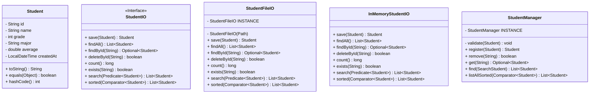

# 📘 Student Management System

**학생 정보 관리 시스템**으로, 다양한 저장 방식(In-Memory / File 기반)을 통해 학생 데이터를 관리하고 검색·정렬·출력할 수 있도록 설계됨
각 구성 요소별 설명과 시스템 동작 흐름을 정리하였습니다.

---

## 🚀 주요 기능

- 학생 등록, 삭제, 수정  
- 학생 검색 (이름 포함 검색, 학년별 검색, 전공별 검색)  
- 학생 정렬 (학년+이름, 평균 내림차순, 이름 오름차순)  
- 학생 목록 전체 조회 및 단일 조회  
- CSV 파일 입출력 지원  
- In-Memory 저장소와 파일 기반 저장소 지원  


## 🏗 시스템 구조



---

## 📂 주요 클래스 설명

### 1. **Domain**
- **`Student`**
  - 학생의 주요 속성을 보관 (`id`, `name`, `grade`, `major`, `average`, `createdAt`)  
  - `equals`, `hashCode` 재정의로 동등성 비교 지원  

---

### 2. **Persistence Layer (저장소)**  
모든 저장소 클래스는 `StudentIO` 인터페이스를 구현합니다.

- **`InMemoryStudentIO`**  
  - 메모리 내 자료구조(Map 등)를 사용해 학생 관리  
  - 빠른 테스트 및 임시 데이터 처리에 유용  

- **`StudentFileIO`**  
  - 파일 시스템을 통해 학생 데이터 저장/로드  
  - 내부적으로 **`StudentDBIO`** 와 **`ObjectIO`**를 활용  
  - 싱글턴 패턴(`INSTANCE`)으로 관리  

- **`StudentDBIO` / `ObjectIO`**  
  - 파일 저장/로드를 위한 하위 계층 지원 클래스  

---

### 3. **Service Layer**  

- **`StudentManager`**
  - 비즈니스 로직 담당  
  - 학생 등록/삭제 전 `validate` 검사  
  - 검색(`SearchStudent`) 및 정렬(`SortedStudent`) 전략을 활용  

---

### 4. **Search & Sort**  

- **`SearchStudent` (인터페이스)**  
  - 이름 포함 검색: `byNameContains(String)`  
  - 학년 검색: `byGrade(int)`  
  - 전공 검색: `byMajor(String)`  

- **`SortedStudent` (인터페이스)**  
  - 학년 → 이름 순 정렬: `byGradeThenName()`  
  - 평균 내림차순: `byAverageDesc()`  
  - 이름 오름차순: `byNameAsc()`  

---

### 5. **Input/Output**  

- **`StudentInput`**
  - CSV 파일을 읽어 학생 객체 생성 (`importCsv`)  
  - 단일 Map 데이터 → Student 변환 (`parseSingle`)  

- **`StudentOutput`**
  - CSV 파일 내보내기 (`exportCsv`)  
  - 학생 목록/단일 출력 지원  

---

### 6. **실행부**

- **`Main`**
  - `public static void main(String[] args)`  
  - 시스템 구동 및 테스트용 진입점  

---

## 🔄 동작 흐름

1. `Main` 실행 → `StudentManager` 초기화  
2. `StudentManager`는 내부적으로 `StudentIO` 구현체(`InMemoryStudentIO` 또는 `StudentFileIO`)를 참조  
3. 사용자 요청에 따라 등록(`register`), 삭제(`remove`), 검색(`find`), 정렬(`listAllSorted`) 수행  
4. 데이터는 `StudentIO` 저장소에 위임되어 저장/조회  
5. 출력은 `StudentOutput`을 통해 콘솔/CSV 파일로 확인 가능  

---

## ⚙️ 확장 포인트

- 데이터 저장소를 **DB (JDBC, JPA)** 기반으로 교체 가능  
- `SearchStudent`, `SortedStudent` 인터페이스 확장으로 다양한 검색/정렬 조건 추가 가능  
- 웹 API(Spring Boot)로 확장하여 RESTful 서비스 제공 가능  

---

## 📝 사용 예시

```java
public class Main {
    public static void main(String[] args) {
        StudentManager manager = StudentManager.getInstance();

        Student s1 = new Student("1", "김주영", 2, "Computer Science", 3.8);
        Student s2 = new Student("2", "고민시", 1, "Mathematics", 3.5);

        manager.register(s1);
        manager.register(s2);

        // 이름 포함 검색
        manager.find(SearchStudent.byNameContains("김"))
               .forEach(System.out::println);

        // 평균 내림차순 정렬
        manager.listAllSorted(SortedStudent.byAverageDesc())
               .forEach(System.out::println);
    }
}
```

---

## 📌 핵심 구현 방향  

본 시스템은 **인터페이스 기반 설계**를 통해 확장성과 유지보수성을 확보를 목적으로 구현하였다.  
- **Persistence (저장소)**,  
- **Business Logic (StudentManager)**,  
- **Input/Output (입출력)**  

